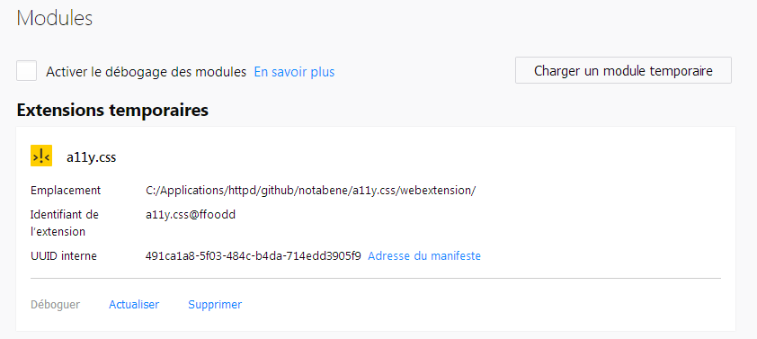
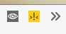
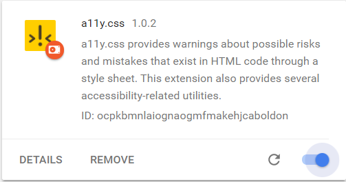
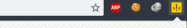

# README for a11y.css WebExtension

This is a port to WebExtension of the [a11y.css bookmarklet](../), because:

* CORS security prevent from running bookmarklets more and more often,
* WebExtension means easier scripting capabilities (e.g. on/off on a set of tests).

## How to test

When developping, you'll need to test an unpackaged version. Before loading it to your browser, first run 
`npm run webext` to package your work.

### Firefox

1. Open `about:debugging` in a new tab
2. Click on "Load a temporary module"
3. Fetch the `a11ycss-webextension-firefox.zip` file from the folder where you have copied the **a11y.css** project.
   
4. And *voilà*, the extension is running.
   

Then you can run the Browser console `Ctrl+Shift+J` to see what's happening. You may see some errors that won't happen once the application will be properly packaged and distributed. Bear with us.

### Chrome

1. Open `chrome://extensions/` in a new tab
2. Click "Developer mode" in the top right
3. CLick on "Load Unpacked"
5. Fetch the `a11ycss-webextension-chrome.zip` file.
   
6. And *voilà*, the extension is running.
   
   
## How to localize

You may want to add some new content, needing texts, or to add support for a whole language.
If so, there's two steps to go.

### Localize text

When adding any UI element in webextension's popup, you have to localize it. This is very, very simple: just put the `localizeMe` class to your HTML element and ensure it has an ID, and you're done!

### Translate text

There's a `locales.js` file in the `scripts` folder that handle every strings. For each string, you'll need to provide the targetted HTML element's ID as key, and webextension's popup will load your localized strings when needed.

## Credits

* Main developer: @notabene
* Based on work by @ffoodd (a11y.css creator) and @ireade (first porting to an extension)
* a11y.css icon by @ffoodd
